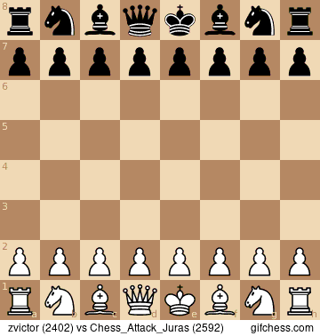
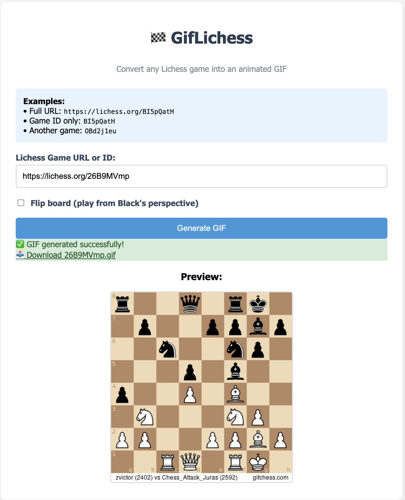

GifLichess
==========

Golang application that converts any Lichess game to an animated GIF with a modern web interface.



## Features

- 🎮 **Web Interface**: User-friendly HTML form for easy GIF generation
- 🔄 **Board Flipping**: Option to view games from Black's perspective
- 📱 **Responsive Design**: Works on desktop and mobile devices
- 🚀 **Fast Processing**: Optimized for quick GIF generation
- 🐳 **Docker Ready**: Containerized for easy deployment
- ☁️ **Heroku Compatible**: Deploy to Heroku with one command
- 🎯 **API Endpoints**: RESTful API for programmatic access

## Live Demo

- **Web Interface**: Access the modern web UI at your deployed instance
- **API Access**: Use RESTful endpoints for integration

## Table Of Contents
1. [Installation](#installation)
2. [Usage](#usage)
   - [Web Interface](#1-web-interface)
   - [API Usage](#2-api-usage)
   - [CLI Usage](#3-cli-usage)
   - [Server Usage](#4-server-usage)
3. [Deployment](#deployment)
4. [Development](#development)
5. [API Reference](#api-reference)

## Installation

### Using Docker (recommended)

```bash
# Build the image
docker build -t giflichess .

# Or use the latest image (if available)
docker pull aherve/giflichess
```

### Build from Go sources

1. Install Go 1.21 or later
2. Install system dependencies:
   ```bash
   # Ubuntu/Debian
   sudo apt install inkscape imagemagick git
   
   # macOS (with Homebrew)
   brew install inkscape imagemagick git
   ```
3. Clone and build:
   ```bash
   git clone <repository-url>
   cd giflichess
   go build
   ```

## Usage

### 1. Web Interface

The easiest way to use GifLichess is through the web interface:

1. **Start the server:**
   ```bash
   # With Docker
   docker run -p 8080:8080 giflichess serve
   
   # Or locally
   ./giflichess serve
   ```

2. **Access the web UI:**
   - Open your browser to `http://localhost:8080`
   - Enter a Lichess game URL or ID (e.g., `BI5pQatH` or `https://lichess.org/BI5pQatH`)
   - Optionally check "Flip board" to view from Black's perspective
   - Click "Generate GIF" and wait for processing
   - The GIF will automatically download and display a preview



### 2. API Usage

#### Generate GIF via API

```bash
# POST request with JSON
curl -X POST http://localhost:8080/api/lichess/BI5pQatH \
  -H "Content-Type: application/json" \
  --output game.gif

# With board flipped
curl -X POST "http://localhost:8080/api/lichess/BI5pQatH?reversed=true" \
  --output game_flipped.gif
```

### 3. CLI Usage

```bash
# With Docker
docker run -v $HOME:/app/out giflichess generate --game BI5pQatH -o /app/out/out.gif

# Locally installed
./giflichess generate --game BI5pQatH -o out.gif

# Get help
./giflichess help generate
```

### 4. Server Usage

```bash
# With Docker
docker run -p 8080:8080 giflichess serve

# Locally installed  
./giflichess serve

# Custom port
./giflichess serve --port 3000
```

## Deployment

### Heroku Deployment

This application is configured for easy Heroku deployment using `heroku.yml`:

1. **Prerequisites:**
   ```bash
   # Install Heroku CLI
   # Login to Heroku
   heroku login
   ```

2. **Deploy:**
   ```bash
   # Create Heroku app (if not exists)
   heroku create your-app-name
   
   # Deploy using Git
   git push heroku main
   
   # Open your deployed app
   heroku open
   ```

3. **View logs:**
   ```bash
   heroku logs --tail
   ```

### Docker Deployment

```bash
# Build for production
docker build -t giflichess:latest .

# Run in production
docker run -d -p 8080:8080 --name giflichess-prod giflichess:latest serve

# Or with docker-compose
docker-compose up -d
```

## Development

### Project Structure

```
giflichess/
├── main.go              # Application entry point
├── server/              # Web server and API routes
├── gifmaker/           # GIF generation logic
├── lichess/            # Lichess API integration
├── static/             # Web UI files (HTML, CSS, JS)
├── Dockerfile          # Local development container
├── Dockerfile.heroku   # Heroku-optimized container
├── heroku.yml          # Heroku deployment config
└── assets/             # Documentation assets
```

### Running Tests

```bash
# Run all tests
go test ./...

# Run with verbose output
go test -v ./...

# Run specific package tests
go test ./gifmaker
```

### Making Changes

1. **Web UI**: Edit files in `static/` directory
2. **API**: Modify `server/server.go`
3. **GIF Generation**: Update `gifmaker/gifmaker.go`
4. **Lichess Integration**: Edit `lichess/lichess.go`

### Environment Variables

- `PORT`: Server port (default: 8080)
- `GTK_BACKEND`: Set to `cairo` for headless environments
- `GOMAXPROCS`: Number of CPU cores to use

## API Reference

### Endpoints

#### `GET /`
Serves the web interface

#### `POST /api/lichess/{gameId}`
Generates a GIF from a Lichess game

**Parameters:**
- `gameId` (path): Lichess game ID (8+ characters)
- `reversed` (query, optional): Set to `true` to flip the board

**Response:**
- Success: GIF file (binary data)
- Error: JSON error message

**Example:**
```bash
curl -X POST "http://localhost:8080/api/lichess/BI5pQatH?reversed=true" \
  --output chess_game.gif
```

#### `POST /generate` (Legacy)
Legacy endpoint for backward compatibility

**Request Body:**
```json
{
  "id": "BI5pQatH",
  "reversed": false
}
```

### Error Responses

```json
{
  "error": "Game not found",
  "code": 404
}
```

Common error codes:
- `400`: Invalid game ID format
- `404`: Game not found on Lichess
- `500`: Internal server error during GIF generation

## Contributing

1. Fork the repository
2. Create a feature branch
3. Make your changes
4. Add tests if applicable
5. Submit a pull request

## License

This project is open source. Please check the license file for details.

---

**Note**: This application uses the Lichess API to fetch game data and generates GIFs using Inkscape and ImageMagick. Make sure you comply with Lichess's terms of service when using this tool.
